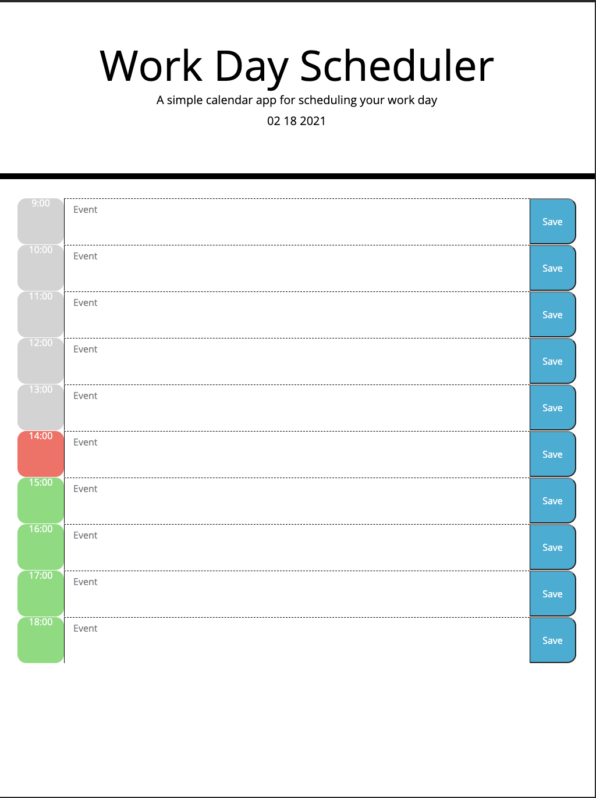

# Work-Day-Scheduler
## Description
I had to develop a work day planner this week. I was given some HTML and CSS starter code. I had to build a javascript using Moment Third-party API. Users had to be able to add events into each time block and save them with a “save button” in the local storage. Users should see each time block with a different color just to make sure they are in the past, present or future.  

## Tools
* HTML
* CSS
* Java Script
* Moment

## Mock-Up

## Deployed link
Please click [here](https://raffee1989.github.io/Work-Day-Scheduler/) to see the website.  

## Licence 
MIT

## GitHub Profile
Please [Visit](https://github.com/Raffee1989)  My GitHub Profile.

